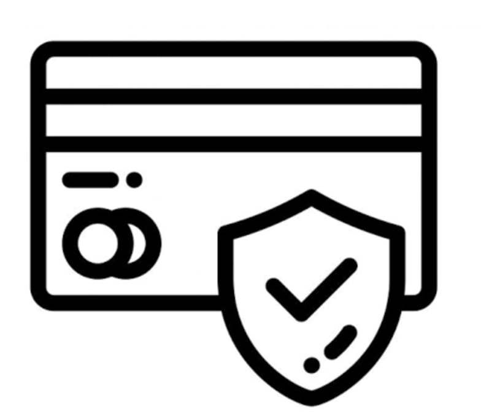
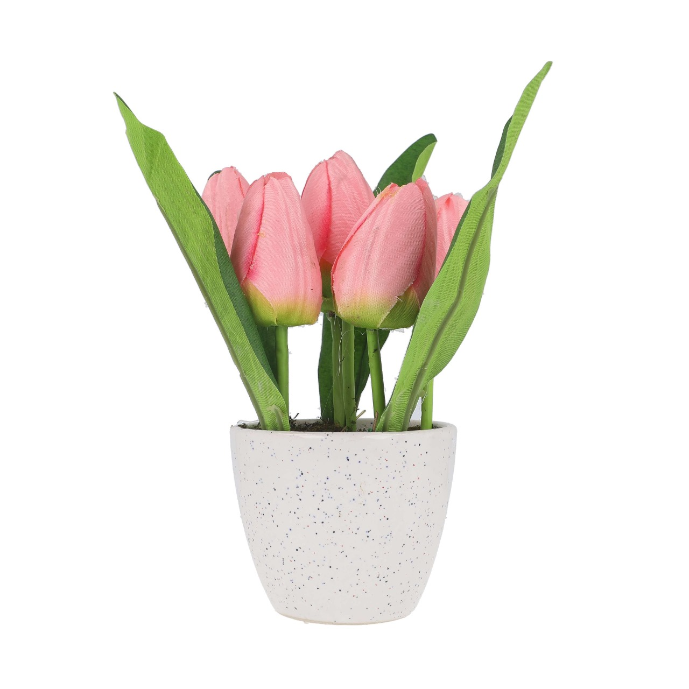
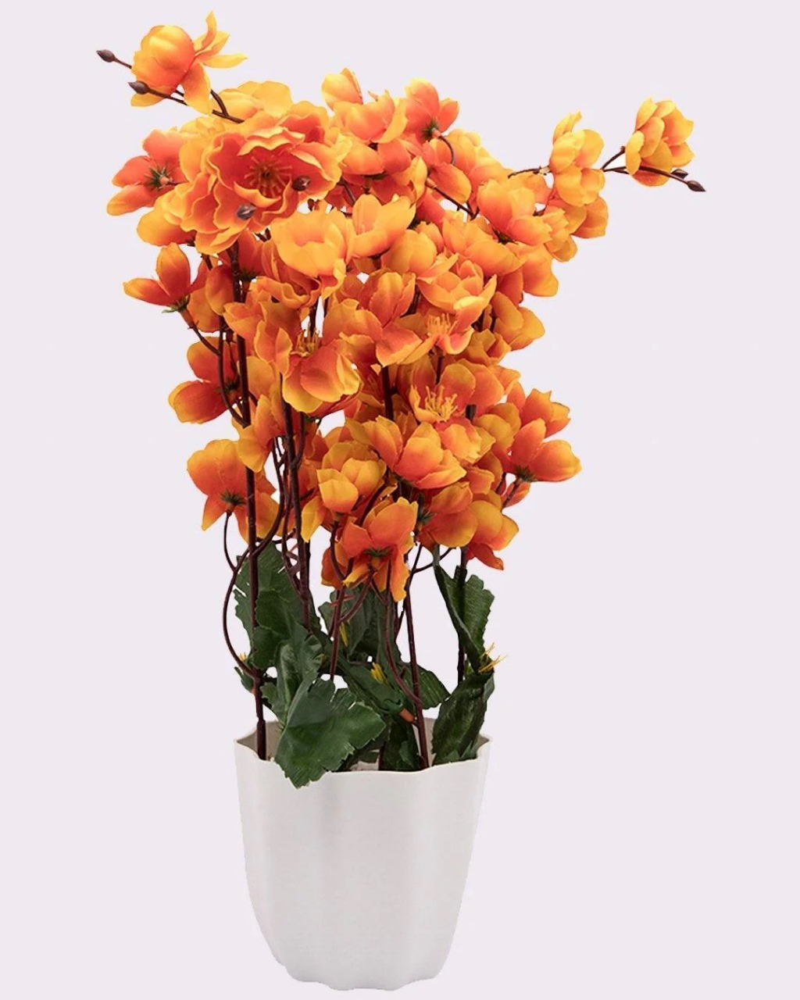
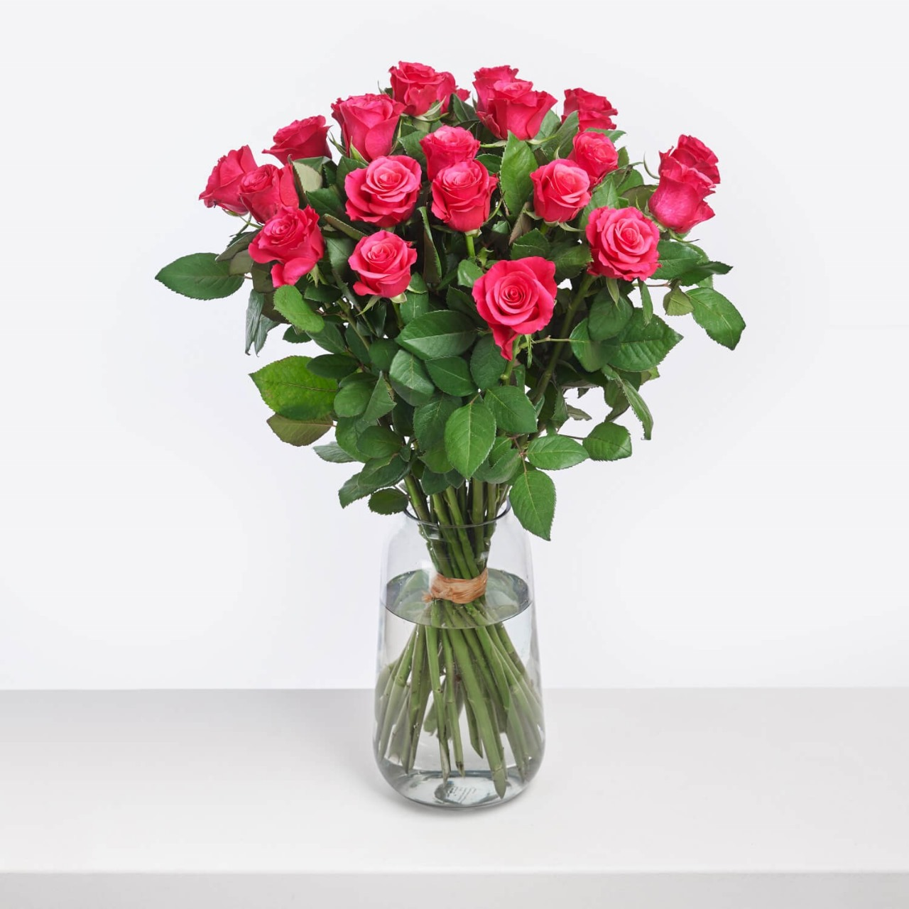
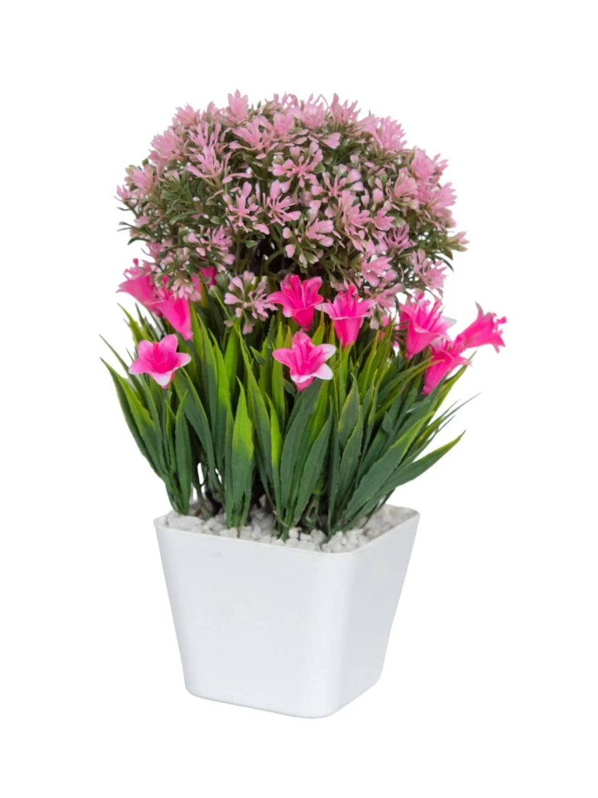
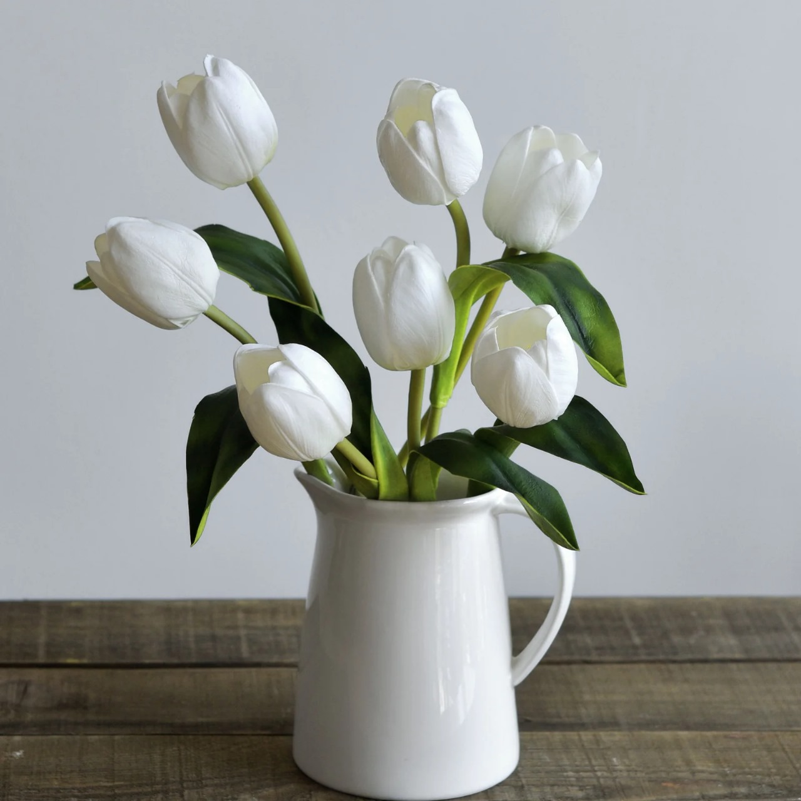
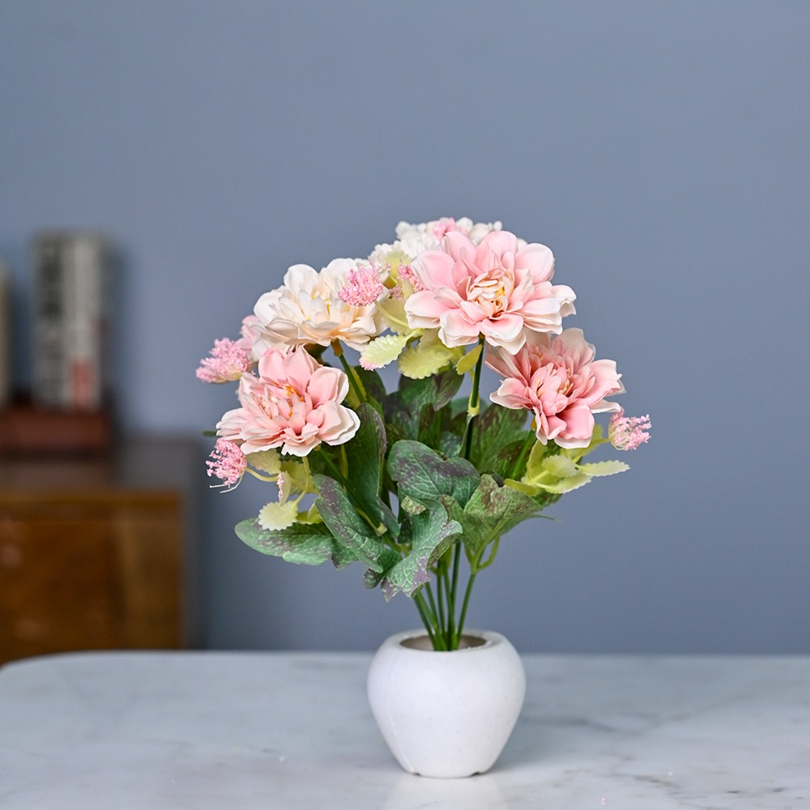
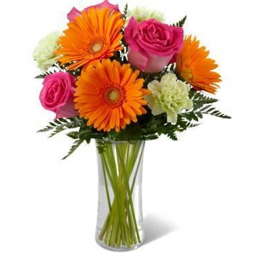
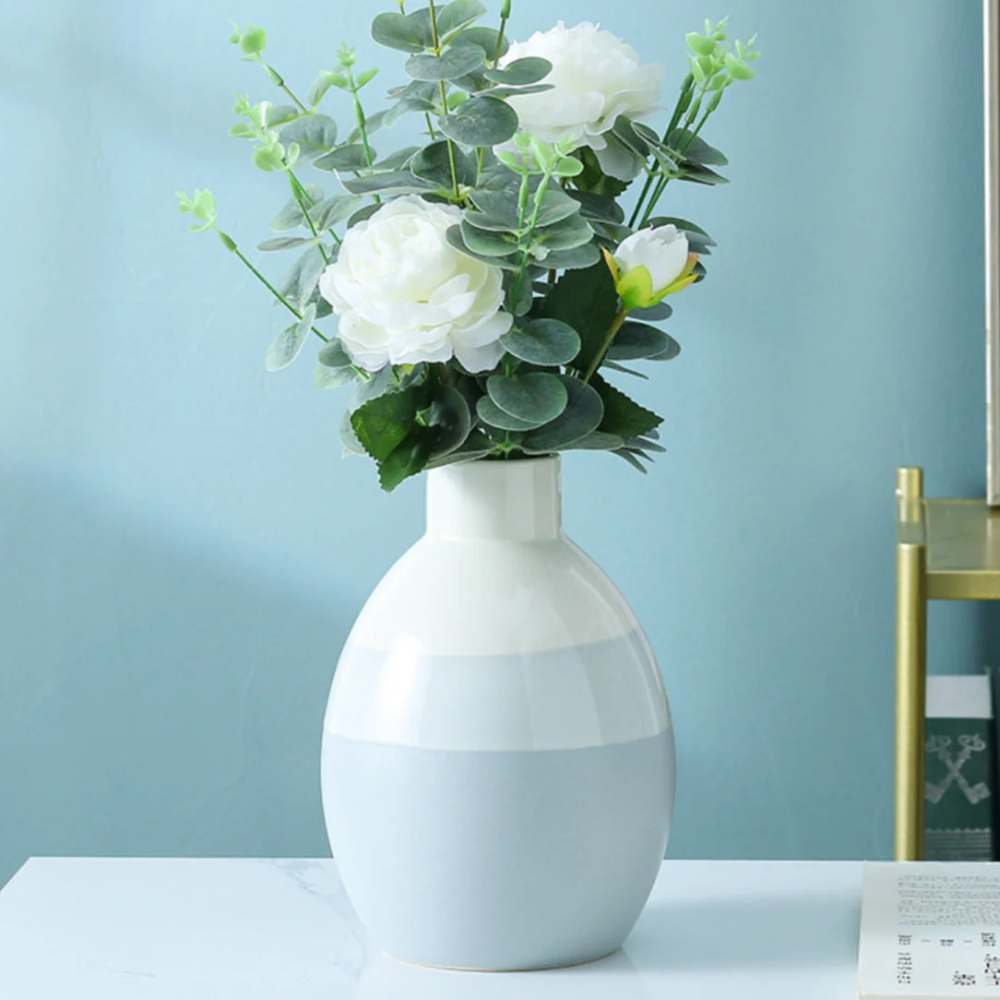

# Ex02 Commercial Website
## Date: 9.8.25
## Name: R MONISH
## Reg No: 212223220061

## AIM
To create a commercial website using CSS Flexbox.

## ALGORITHM
### STEP 1
Create an HTML file (index.html)

### STEP 2
Create a CSS file (style.css)

### STEP 3
Include a navigation bar with links to different sections.

### STEP 4
Add structured sections for Homepage, Products / Services, About Us, Contact Details and User Account.

### STEP 5
Include social media links at the footer with copyright information.

### STEP 6
Define global styles for fonts, colors, and layout.

### STEP 7
Style the header, navigation bar, and sections.

### STEP 8
Use Flexbox for layout design.

### STEP 9
Add hover effects and transitions for interactivity.

### STEP 10
Add Images and Media.

### STEP 11
Use optimized images for a professional look.

### STEP 12
Open the HTML file in a browser to check layout and functionality.

### STEP 13
Fix styling issues and refine content placement.

### STEP 14
Deploy the website.

### STEP 15
Upload to GitHub Pages for free hosting.

## PROGRAM
## HTML
```
<!DOCTYPE html>
<html lang="en">
    <head>
        <meta charset="UTF-8">
        <meta http-equiv="X-UA-Compatible" content="IE=edge">
        <meta name="viewport" content="width=device-width, initial-scale=1.0">
        <title>complete responsive flower website design</title>
        <!-- font awesome cdn link -->
        <link rel="stylesheet" href="https://cdnjs.cloudflare.com/ajax/libs/font-awesome/6.6.0/css/all.min.css">
        <!-- custom css file link -->
        <link rel="stylesheet" href="style.css">
    </head>
    <body>
        <div class="scroll-container">
        <!-- header section starts -->
         <header>
            <input type="checkbox" name="" id="toggler">
            <label for="toggler" class="fas fa-bars"></label>
            <a href="#" class="logo">flower<span>.</span></a>

            <nav class="navbar">
                <a href="#home">home</a>
                <a href="#about">about</a>
                <a href="#products">products</a>
                <a href="#review">review</a>
                <a href="#contact">contact</a>
            </nav>

            <div class="icons">
                <a href="#" class="fas fa-heart"></a>
                <a href="#" class="fas fa-shopping-cart"></a>
                <a href="#" class="fas fa-user"></a>
            </div>
         </header>

        <!-- header section ends-->
        <!-- home secion starts-->
        <section class="home" id="home">
            <div class="content">
                <h3>fresh flowers</h3>
                <span> natural & beautiful flowers </span>
                <p>Lorem ipsum dolor sit, amet consectetur adipisicing elit. Ex debitis, sequi, quis non quae incidunt cum necessitatibus magni, quod sed velit deleniti error quaerat reiciendis! Magnam ab maiores sapiente ullam!</p>
                <a href="#" class="btn">shop now</a>
            </div>
        </section>
        <!-- home secion ends-->
        <!--about section starts-->
        <section class="about" id="about">
            <h1 class="heading"> <span> about </span> us</h1>
            <div class="row">
                <div class="video-container">
                    <video src="video.mp4" loop autoplay muted></video>
                    <h3>best flower sellers</h3>
                </div>

                <div class="content">
                    <h3>why choose us?</h3>
                    <p>Lorem ipsum dolor sit amet, consectetur adipisicing elit. Sint deserunt dicta facere aperiam id, corporis illo quidem reprehenderit perferendis necessitatibus voluptatem molestiae optio ipsa dolores ex eveniet minus eum deleniti.</p>
                    <p>Lorem ipsum dolor sit amet consectetur adipisicing elit. Commodi minus, veniam necessitatibus amet repellat ipsa accusantium in maiores architecto natus nostrum perspiciatis eum, adipisci distinctio delectus nesciunt cum libero? Odit.</p>
                    <a href="#" class="btn">learn more</a>
                </div>
            </div>
        </section>
        <!--about section ends-->

        <!--icons section starts-->
        <section class="icons-container">
            <div class="icons">
                
                <div class="info">
                    <h3>free delivery</h3>
                    <span>on all orders</span>
                </div>
            </div>

            <div class="icons">
                
                <div class="info">
                    <h3>10 days returns</h3>
                    <span>moneyback guarantee</span>
                </div>
            </div>

            <div class="icons">
                
                <div class="info">
                    <h3>offer & gifts</h3>
                    <span>on all orders</span>
                </div>
            </div>

            <div class="icons">
                
                <div class="info">
                    <h3>secure payments</h3>
                    <span>protected by paypal</span>
                </div>
            </div>

    
        </section>
        <!--icons section ends-->
        <!-- product section starts-->

         <section class="products" id="products">
            <h1 class="heading"> latest <span> products </span></h1>
            <div class="box-container">

            <div class="box">
                <span class="discount">-10%</span>
                <div class="image">
                
                <div class="icons">
                <a href="#" class="fas fa-heart"></a>
                <a href="#" class="cart-btn">add to cart</a>
                <a href="#" class="fas fa-share"></a>
                </div>
                </div>
                <div class="content">
                    <h3>flower pot</h3>
                    <div class="price"> $12.99 <span>%15.99</span></div>
                </div>
            </div>

            <div class="box">
                <span class="discount">-15%</span>
                <div class="image">
                
                <div class="icons">
                <a href="#" class="fas fa-heart"></a>
                <a href="#" class="cart-btn">add to cart</a>
                <a href="#" class="fas fa-share"></a>
                </div>
                </div>
                <div class="content">
                    <h3>flower pot</h3>
                    <div class="price"> $12.99 <span>%15.99</span></div>
                </div>
            </div>

            <div class="box">
                <span class="discount">-5%</span>
                <div class="image">
                
                <div class="icons">
                <a href="#" class="fas fa-heart"></a>
                <a href="#" class="cart-btn">add to cart</a>
                <a href="#" class="fas fa-share"></a>
                </div>
                </div>
                <div class="content">
                    <h3>flower pot</h3>
                    <div class="price"> $12.99 <span>%15.99</span></div>
                </div>
            </div>

            <div class="box">
                <span class="discount">-20%</span>
                <div class="image">
                
                <div class="icons">
                <a href="#" class="fas fa-heart"></a>
                <a href="#" class="cart-btn">add to cart</a>
                <a href="#" class="fas fa-share"></a>
                </div>
                </div>
                <div class="content">
                    <h3>flower pot</h3>
                    <div class="price"> $12.99 <span>%15.99</span></div>
                </div>
            </div>

            <div class="box">
                <span class="discount">-17%</span>
                <div class="image">
                
                <div class="icons">
                <a href="#" class="fas fa-heart"></a>
                <a href="#" class="cart-btn">add to cart</a>
                <a href="#" class="fas fa-share"></a>
                </div>
                </div>
                <div class="content">
                    <h3>flower pot</h3>
                    <div class="price"> $12.99 <span>%15.99</span></div>
                </div>
            </div>

            <div class="box">
                <span class="discount">-3%</span>
                <div class="image">
                
                <div class="icons">
                <a href="#" class="fas fa-heart"></a>
                <a href="#" class="cart-btn">add to cart</a>
                <a href="#" class="fas fa-share"></a>
                </div>
                </div>
                <div class="content">
                    <h3>flower pot</h3>
                    <div class="price"> $12.99 <span>%15.99</span></div>
                </div>
            </div>

            <div class="box">
                <span class="discount">-14%</span>
                <div class="image">
                
                <div class="icons">
                <a href="#" class="fas fa-heart"></a>
                <a href="#" class="cart-btn">add to cart</a>
                <a href="#" class="fas fa-share"></a>
                </div>
                </div>
                <div class="content">
                    <h3>flower pot</h3>
                    <div class="price"> $12.99 <span>%15.99</span></div>
                </div>
            </div>

            <div class="box">
                <span class="discount">-18%</span>
                <div class="image">
                
                <div class="icons">
                <a href="#" class="fas fa-heart"></a>
                <a href="#" class="cart-btn">add to cart</a>
                <a href="#" class="fas fa-share"></a>
                </div>
                </div>
                <div class="content">
                    <h3>flower pot</h3>
                    <div class="price"> $12.99 <span>%15.99</span></div>
                </div>
            </div>

            </div>
         </section>
        <!-- product section ends-->

        <!-- review section starts-->
         <section class="review" id="review">
            <h1 class="heading"> customer's <span>review</span></h1>
            <div class="box-container">

                <div class="box">
                    <div class="starts">
                        <i class="fas sa-star"></i>
                        <i class="fas sa-star"></i>
                        <i class="fas sa-star"></i>
                        <i class="fas sa-star"></i>
                        <i class="fas sa-star"></i>
                    </div>
                    <p>Lorem ipsum dolor sit amet consectetur adipisicing elit. Qui debitis odit modi mollitia, eaque expedita ipsam, cum ab fugiat possimus itaque excepturi consequatur unde reiciendis fuga impedit quaerat veritatis cumque.</p>
                    <div class="user">
                        
                        <div class="user-info">
                            <h3>jhanvi Kapoor</h3>
                            <span>happy customer</span>
                        </div>
                    </div>
                    <span class="fas fa-quote-right"></span>
                </div>

                <div class="box">
                    <div class="starts">
                        <i class="fas sa-star"></i>
                        <i class="fas sa-star"></i>
                        <i class="fas sa-star"></i>
                        <i class="fas sa-star"></i>
                        <i class="fas sa-star"></i>
                    </div>
                    <p>Lorem ipsum dolor sit amet consectetur adipisicing elit. Qui debitis odit modi mollitia, eaque expedita ipsam, cum ab fugiat possimus itaque excepturi consequatur unde reiciendis fuga impedit quaerat veritatis cumque.</p>
                    <div class="user">
                        
                        <div class="user-info">
                            <h3>Samantha</h3>
                            <span>happy customer</span>
                        </div>
                    </div>
                    <span class="fas fa-quote-right"></span>
                </div>

                <div class="box">
                    <div class="starts">
                        <i class="fas sa-star"></i>
                        <i class="fas sa-star"></i>
                        <i class="fas sa-star"></i>
                        <i class="fas sa-star"></i>
                        <i class="fas sa-star"></i>
                    </div>
                    <p>Lorem ipsum dolor sit amet consectetur adipisicing elit. Qui debitis odit modi mollitia, eaque expedita ipsam, cum ab fugiat possimus itaque excepturi consequatur unde reiciendis fuga impedit quaerat veritatis cumque.</p>
                    <div class="user">
                        
                        <div class="user-info">
                            <h3>Priyanka Mohan</h3>
                            <span>happy customer</span>
                        </div>
                    </div>
                    <span class="fas fa-quote-right"></span>
                </div>

            </div>
         </section>
        <!-- review section starts-->

        <!--contact section starts-->
        <section class="contact" id="contact">
            <h1 class="heading"> <span> contact </span> us </h1>
            <div class="row">
                <form action="">
                    <input type="text" placeholder="name" class="box">
                    <input type="email" placeholder="email" class="box">
                    <input type="number" placeholder="number" class="box">
                    <textarea name="" class="box" placeholder="message" id="" cols="30" rows="10"></textarea>
                    <input type="submit" value="send message" class="btn">
                </form>
                <div class="img">
                    
                </div>
            </div>
        </section>
        <!--contact section ends-->

        
        <!-- footer section starts-->
         <section class="footer">
            <div class="box-container">

                <div class="box">
                    <h3>quick links</h3>
                    <a href="#">home</a>
                    <a href="#">about</a>
                    <a href="#">products</a>
                    <a href="#">review</a>
                    <a href="#">contact us</a>
                </div>

                <div class="box">
                    <h3>extra links</h3>
                    <a href="#">my account</a>
                    <a href="#">my order</a>
                    <a href="#">my favourite</a>
                   
                </div>

                <div class="box">
                    <h3>locations</h3>
                    <a href="#">india</a>
                    <a href="#">USA</a>
                    <a href="#">japan</a>
                    <a href="#">france</a>
                  
                </div>

                <div class="box">
                    <h3>contact info</h3>
                    <a href="#">9025952561</a>
                    <a href="#">rmonish543@gmail.com</a>
                    <a href="#">kancheepuram,Tamilnadu,India-631502</a>
                    
                  
                </div>

            </div>

        
            <div class="credit"> created by <span> MONISH R </span> |all rights reserved </div>
         </section>
        
        <!-- footer section ends-->
         
    </body>
    

</html>
```
## CSS 
```
:root{
    --pink:#e84393;
}
*{
    margin:0; padding:0;
    box-sizing: border-box;
    font-family: Verdana, Geneva, Tahoma, sans-serif;
    outline: none; border: none;
    text-decoration: none;
    text-transform: capitalize;
    transition: .2s linear;
}

html{
    font-size: 62.5%;
    scroll-behavior: smooth;
    scroll-padding-top: 6rem;
    overflow-x: hidden;
}

section{
    padding:2rem 9%;
}

.heading{
    text-align: center;
    font-size: 4rem;
    color: #333;
    padding: 1rem;
    margin:2rem;
    background: rgba(255,51,153,.05);
    
}

.heading span{
    color: var(--pink);
}

.btn{
    display: inline-block;
    margin-top: 1rem;
    border-radius: 5rem;
    background: #333;
    color: #fff;
    padding: .9rem 3.5rem;
    cursor: pointer;
    font-size: 1.7rem;
}
.btn:hover{
    background:var(--pink);

}

header{
    position: fixed;
    top:0; left:0; right:0;
    background: #fff;
    padding:2rem 9%;
    display: flex;
    align-items: center;
    justify-content: space-between;
    z-index: 1000;
    box-shadow: 0 .5rem 1rem rgba(0,0,0,.1);
}
header .logo{
    font-size: 3rem;
    color: #333;
    font-weight: bolder;
}

header .logo span{
    color:var(--pink)
}
header .navbar a{
    font-size: 2rem;
    padding: 0 1.5rem;
    color: #666;
}
header .navbar a:hover{
    color: var(--pink);

}

header .icons a{
    font-size: 3rem;
    color:#333;
    margin-left: 1.5rem;
}
header .icons a:hover{
    color: var(--pink);
}
header #toggler{
    display: none;
}
header .fa-bars{
    font-size: 3rem;
    color: #333;
    border-radius: .5rem;
    padding: .5rem 1.5rem;
    cursor: pointer;
    border: .1rem solid rgba(0,0,0,.3);
    display: none;
}

.home{
    display: flex;
    align-items: center;
    min-height: 100vh;
    background:url(pink.jpg)no-repeat;
    background-size: cover;
    background-position: center;
}

.home .content{
    max-width: 50rem;

}
.home .content h3{
    font-size: 6rem;
    color: #333;
}
.home .content span{
    font-size: 3.5rem;
    color: var(--pink);
    padding: 1rem 0;
    line-height: 1.5;
}
.home .content p{
    font-size: 1.5rem;
    color:#999;
    padding: 1rem 0;
    line-height: 1.5;
}

.about .row{
    display: flex;
    align-items: center;
    gap: 2rem;
    flex-wrap: wrap;
    padding: 2rem 0;
    padding-bottom: 3rem;
}
 .about .row .video-container{
    flex:1 1 40rem;
    position: relative;
 }

 .about .row .video-container video{
    width: 100%;
    border: 1.5rem solid #fff;
    border-radius: .5rem;
    box-shadow: 0 .5rem 1rem rgba(0,0,0,.1);
    height: 100%;
    object-fit: cover;
 }

 .about .row .video-container h3{
    position: absolute;
    top: 50%; transform: translateY(-50%);
    font-size: 3rem;
    background: #fff;
    width: 100%;
    padding: 1rem 2rem;
    text-align: center;
    mix-blend-mode: screen;
 }
 .about .row .content{
    flex: 1 1 40rem;
 }

 .about .row .content h3{
    font-size: 3rem;
    color: #333;
 }

 .about .row .content p{
    font-size: 1.5rem;
    color: #999;
    padding: 5rem 0;
    padding-top: 1rem;
    line-height: 1.5;
}

.icons-container{
    background: #eee;
    display: flex;
    flex-wrap: wrap;
    gap: 1.5rem;
    padding-top: 5rem;
    padding-bottom: 5rem;
}
.icons-container .icons{
    background: #fff;
    border: 1rem solid rgba(0,0,0,.1);
    padding: 2rem;
    display: flex;
    align-items: center;
    flex:1 1 25rem;
}
.icons-container img{
    height: 5rem;
    margin-right: 2rem;
}
.icons-container .icons h3{
    color: #333;
    padding-bottom: 5rem;
    font-size: 1.5rem;
}
.icons-container .icons span{
    color: #555;
    padding-bottom: 5rem;
    font-size: 1.3rem;
}

.products .box-container{
    display: flex;
    flex-wrap: wrap;
    gap: 1.5rem;
} 

.products .box-container .box{
    flex: 1 1 30rem;
    box-shadow: 0 .5rem 1.5rem rgba(0,0,0,.1);
    border-radius: .5 rem;
    border: .1rem solid rgba(0,0,0,.1);
    position: relative;

}
.products .box-container .box .discount{
    position: absolute;
    top:1rem; left: 1rem;
    padding:.7rem 1rem;
    font-size: 2rem;
    color:var(--pink);
    background: rgba(255,51,153,.05);
    z-index: 1;
    border-radius: .5rem;
}

.products .box-container .box .image{
    position: relative;
    text-align: center;
    padding-top: 2rem;
    overflow: hidden;
}
.products .box-container .box .image img{
    height: 25rem;
}


.products .box-container .box:hover .img img{
    transform: scale(1.1);
}

.products .box-container .box .image .icons{
    position: absolute;
    bottom: -7rem; left: 0; right: 0;
    display: flex;
}
.products .box-container .box:hover .image .icons{
    bottom: 0;
}
.products .box-container .box .image .icons a{
    height: 5rem;
    line-height: 5rem;
    font-size: 2rem;
    width: 50%;
    background: var(--pink);
    color: #fff;

}
.products .box-container .box .image .icons .cart-btn{
    border-left: 1rem solid #fff7;
    border-right: 1rem solid #fff7;
    width: 100%;
}
.products .box-container .box .image .icons a:hover{
    background: #333;
}
.products .box-container .box .content{
    padding: 2rem;
    text-align: center;
}
.products .box-container .box .content h3{
    font-size: 2.5rem;
    color: #333;
}
.products .box-container .box .content .price{
    font-size: 2.5rem;
    color: var(--pink);
    font-weight: bolder;
    padding-top: 1rem ;
}
.products .box-container .box .content .price span{
    font-size: 1.5rem;
    color: #999;
    font-weight: lighter;
    text-decoration: line-through;
}
.review .box-container{
    display: flex;
    flex-wrap: wrap;
    gap: 1.5rem;
}
.review .box-container .box{
    flex:1 1 30rem;
    box-shadow: 0 .5rem 1.5rem rgba(0,0,0,.1);
    border-radius: .5rem;
    padding: 3rem 2rem;
    position: relative;
    border: 1rem solid rgba(0,0,0,.1);
}
.review .box-container .box .fa-quote-right{
    position: absolute;
    bottom: 3rem; right: 3rem;
    font-size: 6rem;
    color: #eee;
}

.review .box-container .box .starts i{
    color: var(--pink);
    font-size: 2rem;
}

.review .box-container .box .p{
    color: #999;
    font-size: 1.5rem;
    line-height: 1.5;
    padding-top: 2rem;
}
.review .box-container .box .user{
    display: flex;
    align-items: center;
    padding-top: 2rem;
}
.review .box-container .box .user img{
    height: 6rem;
    width: 6rem;
    border-radius: 50%;
    object-fit: cover;
    margin-right: 1rem;
}
.review .box-container .box .user h3{
    font-size: 2rem;
    color: #333;

}
.review .box-container .box .user h3{
    font-size: 1.5rem;
    color: #999;
    
}
.contact .row{
    display: flex;
    flex-wrap: wrap;
    gap: 1.5rem;
    align-items: center;

}
.contact .row form{
    flex: 1 1 40rem;
    padding: 2rem 2.5rem;
    box-shadow: 0 .5rem 1.5rem rgba(0,0,0,.1);
    border: .1rem solid rgba(0,0,0,.1);
    background: #fff;
    border-radius: .5rem;
}
.contact .row .image{
    flex: 1 1 40rem;
}
.contact .row .image img{
    width: 100%;
}

.contact .row form .box{
    padding: 1rem;
    font-size: 1.7rem;
    color: #333;
    text-transform: none;
    border: .1rem solid rgba(0,0,0,.1);
    border-radius: .5rem;
    margin: .7rem 0;
    width: 100%;
}
.contact .row form .box:focus{
    border-color: var(--pink);

}

.contact .row form textarea{
    height: 15rem;
    resize: none;
}
.footer .box-container{
    display: flex;
    flex-wrap: wrap;
    gap: 1.5rem;

}

.footer .box-container .box{
    flex: 1 1 25rem; 
}
.footer .box-container .box h3{
    color: #333;
    font-size: 2.5rem;
    padding: 1rem 0;
}
.footer .box-container .box a{
    display: block;
    color: #666;
    font-size: 1.5rem;
    padding: 1rem 0;
}
.footer .box-container .box a:hover{
    color: var(--pink);
    text-decoration: underline;

}
.footer .box-container .box img{
    margin-top: 1rem;

}

.footer .credit{
    text-align: center;
    padding:1.5rem;
    margin-top: 1.5rem;
    padding-top: 2.5rem;
    font-size: 2rem;
    color:#333;
    border-top: .1rem solid rgba(0,0,0,.1);

}

.footer .credit span{
    color: var(--pink);
}
```


## OUTPUT


## RESULT
The program for creating commercial website using CSS Flexbox is executed successfully.
